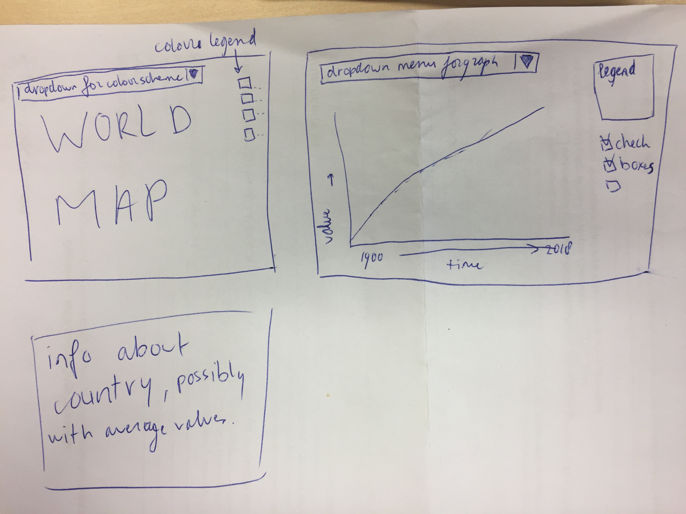

##### Study: Minor programming, University of Amsterdam
##### Course: Programmeerproject
##### Student ID: 10556346
##### Name: Raoul Lieben
##### Content: Proposal for visualizing the world's climate change problem

Project: https://rlieben.github.io/Eindproject

## Functional brain network visualization:

#### Problem Statement:
In the emerging field of functional brain network analysis, visualization methods are scarce and not interactive for a good interpretation of the data. This is because of the novelty of the research field, but also because of the complexity of the understanding of brain data.

#### Solution:
An interactive brain network, showing info on the clickable node and a heat map for connection strength to each other node. 

#### Main features:
•	Interactive, clickable, coloured (colour defines the module each node is assigned to) brain network. A drop down menu lets you select an other input brain network. The clickable nodes triggers:
    o	Interactive table showing info about the node
    o	Heat map for connection-strength to each node in the network
•	Static table showing demographics of the dataset
Sketch: https://github.com/rlieben/Eindproject/blob/master/doc/designsketch.JPG

##### Data:
Anonymized functional brain network with correlation strengths. Obtained from the BioCog research group at the University Medical Center Utrecht. 

#### External components:
•	D3 library : "https://d3js.org/d3.v3.min.js"
•	D3 network libraries: “http://bl.ocks.org/jose187/4733747”

#### Similar visualizations:
There are interactive visualizations of the brain, but not of a functional network the brain shows. The only visualization made are not interactive and only for publishing. A static example is the BrainNet viewer (https://www.nitrc.org/projects/bnv/), but is a plugin for MatLab.

#### Hardest parts:
The hardest part is finding a way to transform the data into a json file containing all connections and connection strengths. Also viewing all connection strengths from one node as a heatmap. And converging the demographics into the file, or putting it in a separate file
