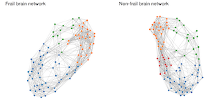
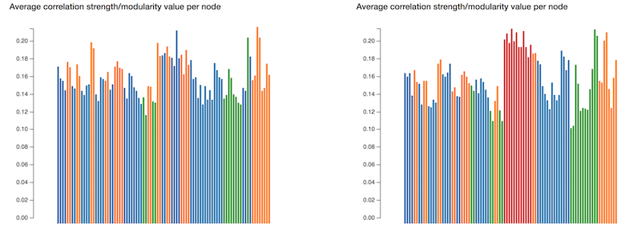
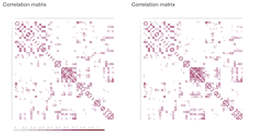

##### Study: Minor programming, University of Amsterdam
##### Course: Programmeerproject
##### Student ID: 10556346
##### Name: Raoul Lieben
##### Content: Visualization of functional frail and non-frail brain network data

Go to project: Github Pages Project: https://rlieben.github.io/Eindproject

# Functional brain network visualization
This application is build to visualize functional brain network data. This field of research is fairly new and that's why a good visualization tool is needed. The schematic overview and draggable nodes give a good insight in how the network is build. The idea was to create a template to observe the network and some network parameters. The idea was later expanded to do not only this, but also add an extra network. The barchart gives a good opportunity to compare certain values of network parameters within and between networks. The heatmap also gives a good insight of the modules. The application is shown with an average frail and non-frail functional brain network. 

{:height="36px" width="60px"}

